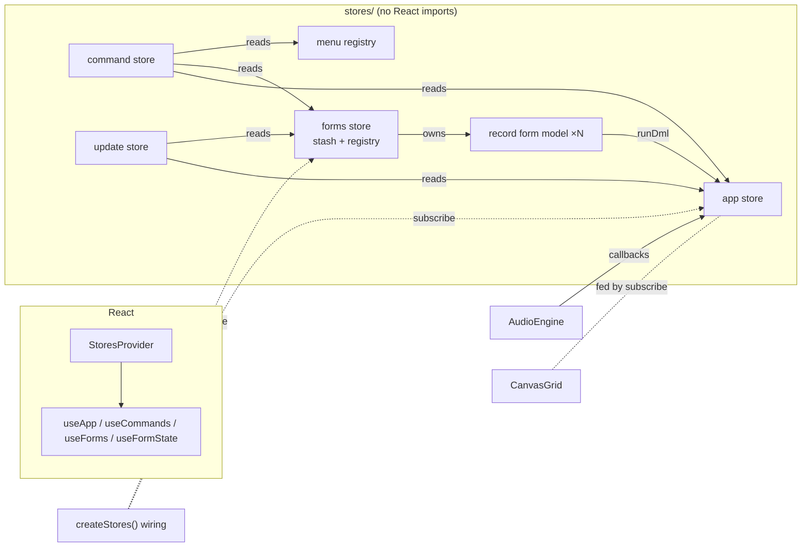

# Frontend migration: SolidJS → React

Implementation plan for porting the production frontend (`frontend/`) from
SolidJS to React. It is split into stages sized for one Claude session each. The
state-management design comes first because every stage depends on it.

## Status

Each stage has a status line. Update it when a stage lands, so a session that
starts cold doesn't have to work out progress from `git log`.

| Stage | Status |
| ----- | ------ |
| 0 — Toolchain and dual tree | done |
| 1 — App store | done |
| 2 — Satellite stores, bindings, React harness | done |
| 3 — UI primitives and shell chrome | done |
| 4 — Tabs, playback bar, palette, shortcuts editor | done |
| 5 — Query toolbar and builders | not started |
| 6 — Results grid and app assembly | not started |
| 7 — Record form model | not started |
| 8 — Record editor: read path | not started |
| 9 — Record editor: editing and picker | not started |
| 10 — Cutover | not started |

## Starting a stage (read this every session)

1. Read **Status**, then **State management** (the whole section), then your
   stage.
2. Read the Solid source for every file in your stage's scope *before* writing
   the React version. It is heavily commented, and those comments record
   behavior decisions. Keep them: a ported file should carry the same doc
   comments, edited where the mechanism changed.
3. Port, don't redesign. The Solid app is the spec. Anything that looks worth
   improving goes under **Deferred follow-ups**, not into the stage.
4. Finish with the gate in **Definition of done** and update **Status**.

## Goals and non-goals

**Goals**

- Behavior stays the same, and so do the pixels. The existing visual baselines
  are the acceptance oracle, and no baseline PNG may change during the port.
- The Solid app keeps working, and keeps passing its tests, until the cutover
  stage, so nothing is broken between sessions.
- React code that is idiomatic and survives `StrictMode`, rather than Solid code
  wearing React syntax.

**Non-goals**

- No new features and no visual changes.
- No backend, `api-client` or `Cargo.toml` changes. Cargo stays out of this
  entirely (see `CLAUDE.md`).
- No change to the framework-free domain modules (`query/`, `commands/` minus
  the store, `api/`, `audio/engine.ts`, `canvasGrid.ts`, `formSave.ts`, and
  similar). They were written to be portable, and this is where that pays off.

## What we're porting

About 21k lines under `frontend/src`. Only about half of it is Solid-coupled:

| Area | Solid-coupled files | Lines (approx.) |
| ---- | ------------------- | --------------- |
| App store | `state/store.tsx` | 2,080 |
| Command store | `state/commands.tsx` | 500 |
| Update controller | `state/update.ts` | 220 |
| Record form model + stash + registry | `components/record/formModel.ts`, `formStash.ts`, `formRegistry.ts` | 1,640 |
| Menu keyboard, gestures | `ui/menuKeyboard.ts`, `gestures/*` | 320 |
| Components | 51 `.tsx` files under `components/`, plus `App.tsx`, `main.tsx` | 6,500 |
| Dev seams | `dev/seed.ts`, `dev/harness/main.tsx`, `dev/harness/stories.tsx` | 750 |

Test surface: 29 harness stories (snapshots in light + dark), 9 Playwright specs
(~2,800 lines, 103 tests, many of them behavioral and driving `window.__appStore`),
and vitest unit tests that are already framework-free.

Solid API usage, for scale: `Show` ×254, `createSignal` ×71, `For` ×51,
`onCleanup` ×40, `onMount` ×35, `createEffect` ×34, `untrack` ×18, `createMemo`
×15, `produce` ×11, `Portal` ×11, `unwrap` ×10.

---

## State management

### What exists today

The Solid app has **five kinds of state**. It helps to name them, because each
goes somewhere different in React:

1. **The app store** (`state/store.tsx`). One `createStore<AppState>` holding
   tabs, per-tab maps keyed by tab id (results, selection, lineage, record
   editor target, builder section, …), presets, modal state, and playback.
   Around it sit loose signals (`audioQuality`, `recordSidebarWidth`,
   `settingOverrides`, `schemaOverride`), three `createResource`s (queries,
   presets, schema), and non-reactive closure state (selection anchor/lead maps,
   run tokens, debounce timers, the `AudioEngine`). The interface exposes about
   100 methods: fine-grained *read accessors* (`isUnsaved(tabId)`,
   `rowSelection(tabId)`) mixed in with *actions* (`clickRow`, `saveQuery`).
2. **The command store** (`state/commands.tsx`). Signals for keymap overrides,
   MRU, palette and shortcuts-editor UI; memos for `context`, `available` and
   `paletteItems`; one global capture-phase `keydown` listener. It reads the app
   store, the form registry and the menu counter.
3. **Module-level singletons.** `update.ts` (four signals), `formRegistry.ts`
   (mounted forms), `formStash.ts` (form models that outlive their component),
   and `menuKeyboard.ts` (a plain counter).
4. **Per-instance models.** `createRecordForm` builds one `createStore<FormState>`
   per edited record set. The state is flat and id-keyed (`records`, `lists`,
   `embeds`, `expanded`, …). The model lives in the stash, not in a component,
   and holds non-reactive registries (item handles, root element, load tokens).
5. **Component-local signals.** Menus' open positions, hover/overflow flags,
   input text buffers.

The app also depends on some Solid-specific mechanics that React won't
reproduce:

- **Identity-based effects.** `QueryResults` pushes into the canvas from
  `createEffect`s that track leaves such as `resultsByTab[tabId]`. There are
  known traps here: `setState` *merges* objects at a leaf, hence
  delete-then-set in `setTabResult` / `setRecordEditorRecords`, and effects run
  before `onMount`, hence `applyReveal` running twice.
- **Events carried as signals.** `rowReveal`, `rowPatch` and `builderFocus` are
  `{…, seq}` values that consumers react to, and late mounters read the pending
  value.
- **In-place mutation of a class instance.** `QueryResult.patchRow` rewrites
  one row inside the stored result, then `rowPatch` asks for a repaint.
- **State→state effects in components.** `QueryPage` prunes the form stash when
  tabs change, and re-points the record editor when the selection changes (with
  `untrack` to avoid a loop).

### Decision: Zustand vanilla stores + Immer, with selectors

| Concern | Choice |
| ------- | ------ |
| Store library | **Zustand 5**, using `zustand/vanilla` `createStore` (stores are created outside React) |
| Updates | **Immer** through Zustand's `immer` middleware, so writes are `set((draft) => { … })` |
| Subscriptions outside render | Zustand `subscribeWithSelector` middleware |
| React binding | `useStore(store, selector)` (built on `useSyncExternalStore`), wrapped in typed hooks |
| Server data | **No TanStack Query.** Load-once fields with a `status`, filled by boot actions (see below) |
| Persistence | Hand-written helpers (the existing `stored*` / `persist*` functions), **not** `persist` middleware |

**Why this fits the code we have:**

- **The port stays mechanical.** The app store is already "one big object plus
  methods that mutate it through `produce`". With Immer, `editQueryTab`,
  `closeTab` and `reorderTab` port almost line for line. MobX would be even
  closer semantically, but it would bring back the reactivity rules this
  migration is meant to leave behind: destructuring loses tracking, and
  `observer` wrappers are needed everywhere.
- **Code outside React needs the stores.** The audio engine's callbacks, the
  update controller, the global `keydown` pass, Playwright via
  `window.__appStore`, and form models living in a stash all read and write
  state from outside any component. Vanilla Zustand stores are plain objects with
  `getState` / `setState` / `subscribe`, so none of that code needs React.
  Context-plus-`useReducer` can't do this, and Redux Toolkit could but at far
  more ceremony.
- **Selectors give us fine-grained updates back.** A component subscribes to
  `s.selectionByTab[tabId]`, not to the store as a whole, so a selection change
  re-renders only what reads it. That is how React recovers most of what Solid's
  fine-grained tracking gave us.
- **Immer removes a class of bug.** Every write produces new references along the
  changed path, so "replace, don't merge" becomes the default. The
  delete-then-set workarounds and `unwrap` go away.
- **Why not TanStack Query.** The server data is five lists loaded once at boot
  (queries, presets, schema, settings, keybindings). After loading, the client
  *owns* presets and overrides and edits them optimistically. Query results are
  per-tab, token-guarded, debounced, mutable class instances patched in place.
  None of that is key-addressed cache data, and a second cache would have to be
  kept in step with local edits. Revisit this if the app grows real server
  collections.

### Store topology



**Dependency direction is one-way.** The app store imports no other store. The
forms store may call app actions, since models save through
`app.actions.runRecordDml`. The command and update stores read all the others.
Any rule that spans stores (for example "when a tab closes, drop its forms")
lives in `createStores()` as a `subscribe` call, not inside either store.

`createStores()` builds the whole bundle **once, outside React**, in `main.tsx`
and in the harness entry. It runs the boot loads and returns
`{ app, forms, commands, update, menus, dispose }`. `<StoresProvider stores>`
only hands the bundle down through context. Building outside React keeps
`StrictMode`'s double render and double effects away from boot fetches, the
`matchMedia` listener, and service-worker registration.

### The shape of a store module

Each store is split into **state**, **actions** and **selectors**. The current
`AppStore` interface mixes reads with writes. Pulling them apart is the one
structural change the port makes on purpose:

```ts
// stores/app/index.ts — sketch
export function createAppStore(env: AppEnv = browserEnv()) {
  const store = createStore<AppState>()(
    subscribeWithSelector(immer(() => initialState(env))),
  );
  const get = store.getState;
  const set = store.setState; // set((draft) => { … })

  // Non-reactive internals stay closure variables, exactly as today:
  const rowClickAnchor = new Map<string, number>();
  const runTokens = new Map<string, number>();
  let audio: AudioEngine | undefined;
  // …

  const actions = {
    closeTab(id: string) {
      set((s) => { /* the same body as today's produce() */ });
      rowClickAnchor.delete(id);
      // …
    },
    // …every write method from today's AppStore
  };
  return { store, actions, dispose };
}
export type AppStoreBundle = ReturnType<typeof createAppStore>;
```

```ts
// stores/app/selectors.ts — pure functions of state
export const selectRowSelection = (s: AppState, tabId: string) =>
  s.selectionByTab[tabId] ?? EMPTY_SELECTION;
export const selectIsUnsaved = (s: AppState, tabId: string) => { … };
```

```tsx
// stores/react.tsx — the only file under stores/ that imports React
export const useApp = <T,>(selector: (s: AppState) => T) =>
  useStore(useStores().app.store, selector);
export const useAppActions = () => useStores().app.actions;

// in a component
const unsaved = useApp((s) => selectIsUnsaved(s, tabId));
const { saveQuery } = useAppActions();
```

**Rules**, to be added to `CLAUDE.md` at cutover and followed from stage 1:

1. **Actions are stable and live outside state.** Never put functions in
   `AppState`, and never select them. Components get actions from
   `useAppActions()`, so they can be used in effect dependency arrays without
   causing churn.
2. **A selector returns a primitive, a reference that already exists in state,
   or a shared constant** (`EMPTY_SELECTION`, `EMPTY_LIST`). A selector that
   builds a new array or object (`presetsFor`, `rowRecords`, `available`
   commands) must be wrapped in `useShallow`, or computed in the component with
   `useMemo` over narrower selections. Otherwise it re-renders on every store
   write.
3. **Never subscribe to whole state** (`useApp((s) => s)`). Enforce it with
   lint (`no-restricted-syntax`) if it ever shows up.
4. **Actions read `get()` after every `await`,** never a value captured before
   it. Today's code already guards with run and load tokens; keep them.
5. **Actions triggered by user gestures run synchronously inside the event
   handler.** This matters a great deal for `playRow` / `togglePlayPause`: iOS
   ties audio permission to the gesture's call stack (see
   `audio/engine.ts:unlock`). Never route "play" through "set state → effect".
6. **`stores/` never imports React,** except `stores/react.tsx`. Enforce it with
   ESLint `no-restricted-imports`, which keeps the stores unit-testable in plain
   vitest.
7. **Environment access is injected.** `localStorage`, `matchMedia` and the
   `document` theme writes go through an `AppEnv` argument with a browser
   default, so store tests can pass fakes. `api-client` stays a direct import and
   is replaced in tests with `vi.mock`.

### Mapping each Solid construct to its React home

| Today (Solid) | Where | React |
| ------------- | ----- | ----- |
| `createStore<AppState>` + `produce` | `store.tsx` | Zustand vanilla store + `immer` middleware |
| `batch(() => { setState…; setState… })` | `setTabResult`, … | One `set((s) => { … })` call, which is already atomic |
| Delete-then-set to force a new reference | `setTabResult`, `setRecordEditorRecords` | Plain assignment. Immer produces a new reference anyway |
| `unwrap(t.live)` | several actions | Not needed, because state is plain (frozen) data |
| Loose signals in the store (`audioQuality`, `recordSidebarWidth`, `settingOverrides`, `schemaOverride`) | `store.tsx` | Ordinary `AppState` fields |
| `createResource` (queries, presets, schema) | `store.tsx` | `{ status, data, error }` fields plus `loadQueries` / `loadPresets` / `loadSchema` actions, run by `createStores()`. `refetchQueries` becomes an action |
| `createMemo(schemaTables)` | `store.tsx` | Computed **at write time**: `setSchema(json)` stores `json` and the parsed `tables` together |
| Read accessors (`isUnsaved`, `canRevert`, `presetDirty`, `rowRecords`, …) | `AppStore` | Pure selectors in `stores/app/selectors.ts` |
| Non-reactive closure maps (anchor, lead, tokens, timers, `autoRun`, engine) | `store.tsx` | Unchanged: closure variables in `createAppStore` |
| Event signals `rowReveal`, `rowPatch`, `builderFocus` | `store.tsx` | Stay **seq-stamped state slots**, so late mounters can read the pending one. Imperative consumers use `store.subscribe` (next section), and the builder reads with a selector and clears with an action |
| `createMemo` `context` / `available` / `paletteItems` / `clampedIndex` | `commands.tsx` | `selectCommandContext(app, forms)` as a pure function. The keydown pass calls it at keypress time using `getState()`. The palette computes `available` / `paletteItems` with `useMemo` over subscribed inputs |
| Module signals in `update.ts` | `update.ts` | `updateStore` (`ready`, `stale`, `version`, `dismissed`) plus a `selectUpdateNotice` selector |
| `formRegistry` / `formStash` module signals | `record/` | One **forms store** (see below) |
| Per-form `createStore<FormState>` | `formModel.ts` | Per-form vanilla store with the same `FormState` shape, plus an actions object |
| `menuKeyboard` counter | `ui/menuKeyboard.ts` | A `menus` registry holding a `Set<symbol>` rather than a counter, so StrictMode's mount/unmount/mount can't miscount |
| `createEffect` pushing into an imperative object | `QueryResults`, … | `useEffect` + `store.subscribe(selector, listener, { fireImmediately: true })`, with **no React re-render** involved |
| `createEffect` state → state (`pruneForms`, the "Dynamic updates" editor resync) | `QueryPage` | Wiring subscriptions in `createStores()` (next section) |
| `createEffect` view-triggered work (auto-run on first view, builder focus) | `QueryPage`, builders | `useEffect` with real dependencies |
| `createEffect(on(() => props.tabId, closeMenu))` | `QueryResults` | Local state reset in `useEffect([tabId])`, or `key={tabId}` on the menu host |
| `onMount` / `onCleanup` | everywhere | `useEffect` / `useLayoutEffect` (use layout when focus or measurement must happen before paint) |
| `untrack(() => props.x)` ("read once for this instance's life") | `RecordForm`, `FieldRow`, `ValueInput` | `useState(() => …)` initializer, with the parent supplying a `key` so a new subject means a new instance |
| `createMemo(…, { equals })` | `RecordEditorPanel.formRecords` | `useMemo` keyed on the identity **string**, which gives the same effect |
| `<Show keyed>` | `RecordEditorPanel` | `key={formKey}` |
| `Show` / `For` / `Index` / `Switch`+`Match` / `Dynamic` | components | `&&` / ternary, `.map` with stable `key`, a component variable |
| `Portal` | `Modal`, `ContextMenu`, … | `createPortal(…, document.body)`. Solid's `Portal` adds a wrapper `<div>` and React's doesn't (see **Risks**) |
| `classList={{…}}` | components | A local `cx()` helper, a few lines with no dependency |
| Icons called as functions, `Icons.Edit({ class })` | components | `<Icons.Edit className="…" />` |

### Imperative bridges: canvas, audio, DOM listeners

**Imperative objects are fed from subscriptions, not from renders.** The results
grid is the model case. Split `QueryResults` into two effects: one that creates
the grid once, and one keyed on the tab that subscribes it to state:

```tsx
// sketch — components/QueryResults.tsx
const gridRef = useRef<CanvasGrid>();
useLayoutEffect(() => {
  const grid = new CanvasGrid(canvasRef.current!);
  gridRef.current = grid;
  // ResizeObserver, theme observers, visibility → as today
  return () => { /* disconnect */ grid.destroy(); };
}, []);

useEffect(() => {
  const grid = gridRef.current!;
  const { store } = stores.app;
  const subs = [
    store.subscribe((s) => s.resultsByTab[tabId], (r) => grid.setResult(r), { fireImmediately: true }),
    store.subscribe((s) => selectRowSelection(s, tabId), (sel) => grid.setSelection(sel), { fireImmediately: true }),
    store.subscribe((s) => selectCurrentRow(s, tabId), (row) => grid.setCurrentRow(row), { fireImmediately: true }),
    store.subscribe((s) => s.rowPatch, (p) => { if (p?.tabId === tabId) grid.redraw(); }),
    store.subscribe((s) => s.rowReveal, (r) => { if (r?.tabId === tabId) grid.revealRow(r.row); }, { fireImmediately: true }),
    subscribeModifiedRows(stores, tabId, (rows) => grid.setModifiedRows(rows)),
  ];
  return () => subs.forEach((off) => off());
}, [tabId, stores]);
```

Grid interaction callbacks call `stores.app.actions.*` directly. The component
re-renders only when its own row-menu state changes.

The Solid-era "effects run before `onMount`" workaround disappears, because
`fireImmediately` runs the listener at subscription time, once the grid exists.

**The audio engine is unchanged.** Its constructor takes `getQuality: () =>
AudioQualityPref`; pass `() => get().audioQuality`. Its callbacks call internal
actions, as they do today.

**The global keydown pass** is installed once. It can go in `createStores()`,
which is preferable because it needs no component, or in a provider `useEffect`
with a guard. It reads every store through `getState()` at keypress time, which
removes the need for any memo.

### Cross-store wiring (the state→state rules)

These two effects move out of `QueryPage` into `createStores()`, because they
enforce state consistency and have nothing to do with rendering:

```ts
// stores/createStores.ts — sketch
app.store.subscribe(
  (s) => s.tabs.map((t) => t.id),
  (ids) => forms.actions.prune(ids),
  { equalityFn: shallow },
);

// "Dynamic updates": keep an open record editor pointed at the selection.
app.store.subscribe(
  (s) => [s.selectionByTab, s.lineageByTab] as const,
  () => app.actions.resyncRecordEditors(),
  { equalityFn: shallow },
);
```

`resyncRecordEditors` holds today's effect body, for every tab with an open
editor. It reads the editor target through `get()`, and it isn't a subscription
input, so the loop that `untrack` guarded against can't form.

The auto-run on first view **stays in `QueryPage`**:
`useEffect(() => { if (schemaReady && presetsReady) actions.ensureRun(tabId) },
[tabId, schemaReady, presetsReady])`. It runs because a view appeared, which is
exactly what an effect is for.

### The record editor form

This is the most delicate state in the app. Three decisions:

**1. The model is a per-form vanilla store plus an actions object, created
outside render.**

```ts
interface RecordFormModel {
  store: StoreApi<FormState>;       // same FormState as today
  actions: RecordFormActions;       // toggleField, beginEdit, save, … (today's methods)
  start(): void;                    // kicks off the root load — idempotent
  dispose(): void;
  // non-reactive: items Map<string, ItemHandle>, root element, tokens, specs cache
}
```

Today `createRecordForm` begins loading as it's constructed. React may call
render-phase code twice, so construction must be side-effect free.
`RecordForm` obtains the model with `useState(() => forms.actions.stashedForm(…))`,
which is idempotent because it looks up the stash first, and calls
`model.start()` from `useEffect`.

**2. Reads are selectors over `FormState`, and recursive derivations are
memoized per snapshot.**

Components read `useFormState(model, (s) => sharedValue(s, recordId, column))`.
`isFieldModified` / `isRecordModified` recurse through `records` and `lists`,
and every visible row asks. Immer gives each write a new root object, so cache
by snapshot:

```ts
const modifiedCache = new WeakMap<FormState, Map<string, boolean>>();
export function selectRecordModified(s: FormState, recordId: string): boolean {
  let memo = modifiedCache.get(s);
  if (!memo) modifiedCache.set(s, (memo = new Map()));
  // compute once per (snapshot, recordId); fieldModified reuses the same memo
}
```

The whole form's star computation then costs O(nodes) per keystroke, however
many rows subscribe.

**3. The forms store holds the stash and the registry, and mirrors a summary of
each model.**

```ts
interface FormEntry {
  tabId: string;
  identities: readonly string[];
  model: RecordFormModel;
  mounted: number;           // replaces formRegistry membership (StrictMode-safe count per entry)
  summary: { focused: boolean; selecting: boolean; pickerOpen: boolean; modified: boolean };
}
```

When a model is stashed, the forms store subscribes to it and writes `summary`
whenever the summary changes (compared with `shallow`). The consumers that sit
*across* forms can then use plain selectors over one store:

- `focusedForm` → the command context, and routing for `selection.*` /
  `results.select_*`
- `recordPickerOpen` → the keyboard-pass suppression
- `modifiedRecords(tabId)` → the grid's ✱ rows, and the update policy's
  `recordsUnsaved`

No hook ever has to subscribe to N stores.

**DOM registries stay non-reactive.** `registerItem` / `unregisterItem` move to
`useEffect` with cleanup. An `ItemHandle`'s closures must read **current** state
(`model.store.getState()`) or call actions by id, and must never capture values
from the render that registered them. `reconcileFocus`'s `queueMicrotask` stays.

### Local component state

Keep today's placement decisions. Anything a component holds in a Solid signal
that doesn't need to outlive it (a row menu's position, `FieldRow`'s
`overflowing`, `ValueInput`'s text buffer, drag translate) becomes `useState`.
Anything that already lives in a store *because* it has to survive unmounting
(the shortcuts editor's search, capture state and record mode, which live in the
command store because the editor is a tab) stays in the store. The Solid code's
comments say which is which.

**Controlled inputs** write to the store synchronously in `onChange`. Zustand
notifies synchronously, so the caret doesn't jump. The debounce stays where it
is today, on the *query run* (`editLiveDebounced`), not on the store write.

### StrictMode

Turn on `<StrictMode>` from stage 2. It double-invokes render functions,
initializers and effects in development, and so it catches the non-idempotent
patterns that Solid tolerated because components ran once:

- Registration counts (menus, forms) use sets or per-entry counts, never a bare
  `++`/`--`.
- No fetch, timer or subscription starts during render or inside a `useState`
  initializer. `start()` in an effect, boot in `createStores()`.
- Every `addEventListener` / `subscribe` in an effect returns its cleanup.

### Dev and test seams

- **`window.__appStore`** (behavioral specs, gated on `?expose=1`). Until the
  cutover the specs have to drive both apps unchanged, so the React seed exposes
  a **compat facade** with the Solid names the specs use today: a `state` getter
  returning `store.getState()`, `rowSelection(id)`, `queryTab(id)`,
  `recordSidebarWidth()`, `setResults`, `setResultRow`, `clickRow`. Collect the
  full list with `grep -n "__appStore" tests/visual`. After the cutover it can be
  simplified or kept.
- **Stories.** A story's `setup(store, commands)` becomes `setup(stores)`, and
  `render` returns React JSX. **Story ids don't change,** because the ids are the
  baseline paths.
- **Store unit tests.** vitest in `node`, with a fake `AppEnv` and
  `vi.mock("api-client")`. Test the behaviors that today are only exercised
  through the UI: see stage 1.

---

## Migration strategy: a dual tree

The React app is built **alongside** the Solid app in `frontend/src/app/`,
sharing the framework-free modules in place, and served from separate dev
entries. It replaces the Solid app in one cutover stage.

Why not port in place: every Solid component depends on `useAppState()`. Once
the store is replaced, *all* of them break together, and the app and harness
stay broken for eight or so sessions. With the dual tree, each stage can be
checked against the **same baseline PNGs** through a second harness entry. That
is the strongest oracle available, and it costs one stage of toolchain work.

```
frontend/
  index.html            Solid app (production build input, unchanged until cutover)
  harness.html          Solid harness
  react.html            React app        (dev-only entry, stage 6)
  react-harness.html    React harness    (dev-only entry, stage 2)
  src/
    query/ commands/ api/ audio/ grid/ record/ …   framework-free, shared
    state/settings.ts state/updatePolicy.ts        pure, shared
    dev/fixtures.ts gridFixture.ts recordFixture.ts dev/harness/mockApi.ts   shared
    state/store.tsx components/**/*.tsx …          Solid — deleted at cutover
    app/                                           React
      main.tsx App.tsx
      stores/ createStores.ts react.tsx app/ commands.ts update.ts forms.ts menus.ts recordForm/
      components/ (mirrors src/components)
      gestures/
      dev/ seed.ts harness/main.tsx harness/stories.tsx
```

`vite build` keeps `index.html` as its only input, so nothing under `src/app/`
reaches production before the cutover.

**Branch:** do the work on `react-port`. While it's open, **freeze feature work
on the Solid frontend.** Any fix that has to land on `main` in the meantime must
be ported into `src/app/` too, and the stage that owns the file should note it.

---

## Definition of done (every stage)

From `frontend/`:

1. `bun run typecheck`: both tsconfig projects clean.
2. `bun run lint` and `bun run format:check` clean.
3. `bun run test:unit` green.
4. **Solid unchanged:** `bun run test:visual --project=solid` green.
5. **React parity:** `bun run test:visual --project=react --grep "<this stage's
   stories/specs>"` green **against the existing baselines**. Also re-run the
   earlier stages' React stories. They're cheap, and a shared primitive may have
   moved.
6. **No `__screenshots__` file changed** (`git status tests/visual/__screenshots__`).
   A React snapshot that doesn't match is a port bug until proven otherwise. The
   memory note "Visual snapshot failures are real" applies. If a difference
   truly can't be avoided, stop and ask. Don't regenerate.
7. Status table updated, and anything deferred written into **Deferred
   follow-ups**.
8. An `#### As built` note under the stage, covering what landed, where it
   departs from the plan, what's left, and what the next stage needs to know.
   Later stages treat these notes as overriding the plan text.
9. One commit on `react-port`: `React port, stage N: <title>`.

Stages are run one per session with the `/port-next` command
(`.claude/commands/port-next.md`), which follows exactly these steps.

No Cargo files are touched in any stage.

---

## Stages

### Stage 0 — Toolchain and dual tree

**Goal:** React and Solid build, lint, typecheck and serve side by side, and a
trivial React harness page renders.

- **Dependencies.** Add `react`, `react-dom`, `@types/react`, `@types/react-dom`,
  `@vitejs/plugin-react` (the release that supports Vite 8), `zustand`, `immer`,
  and `eslint-plugin-react-hooks`. Check that each one's peer dependencies accept
  `typescript@6`: the memory note "Frontend TS7/ESLint split" says to keep TS 6
  pinned.
- **`vite.config.ts`.** `solid({ exclude: ["src/app/**"] })` and
  `react({ include: /src\/app\/.*\.tsx$/ })`. Confirm by running both `dev` and
  `build` that neither plugin transforms the other tree.
- **Icons spike.** `unplugin-icons` takes one global `compiler` (`"solid"`
  today). Find out whether the React tree can get React components from the same
  `~icons/*` imports. If it can't, fall back as follows: the React `icons.ts`
  imports `?raw` and renders an `<svg>` with the same attributes unplugin emits
  (`viewBox`, `width="1.2em"`, `height="1.2em"`, inner markup). That keeps the
  pixels identical. At cutover, switch to `compiler: "jsx", jsx: "react"`. Record
  the outcome here.
- **TypeScript.** Split into `tsconfig.solid.json` (excludes `src/app`,
  `jsxImportSource: solid-js`, `unplugin-icons/types/solid`) and
  `tsconfig.react.json` (includes `src/app` plus the shared modules,
  `jsx: react-jsx`, React icon types). `typecheck` runs `tsgo` on both.
- **ESLint.** Scope `eslint-plugin-solid` to everything except `src/app/**`, and
  `react-hooks` (recommended, including the rules-of-hooks and exhaustive-deps
  equivalents) to `src/app/**`. Add `no-restricted-imports` so that
  `src/app/stores/**` (except `react.tsx`) can't import `react`, and the shared
  modules can't import either framework.
- **Move the framework-free modules out of `components/`** so the cutover's
  deletion doesn't catch them: `components/canvasGrid.ts` → `src/grid/`, and
  `components/record/{formSave,formSave.test,formIds,formNav,formValues}.ts` →
  `src/record/`. (These were checked and have no Solid or store imports.
  `tabKind.ts` does, through Solid's `Component` type and the store's `TabKind`,
  so it is ported in stage 3 rather than moved.) Update the Solid imports. This is
  mechanical, and the Solid tests must stay green.
- **Playwright.** Add two projects, `solid` and `react`, and make the harness
  entry and app path per-project fixtures (`harness.ts` reads them).
  `snapshotPathTemplate` stays shared, so both projects compare against the same
  PNGs. `bun run test:visual` runs both.
- **Entries.** Add `react-harness.html` → `src/app/dev/harness/main.tsx`, which
  renders a placeholder for now.
- **React Compiler (optional).** If `babel-plugin-react-compiler` works with the
  chosen plugin on Vite 8, enable it for `src/app/**` and note that here. If it
  doesn't, skip it. Nothing in this plan depends on it.

**Done when:** the gate passes, and `/react-harness.html` renders in the dev
server.

#### As built

**What landed**

- **Dependencies:**
  - React and state: `react` / `react-dom` 19.3, `zustand` 5.0.15, `immer` 11.1.18.
  - Dev: `@types/react(-dom)` 19.3, `@vitejs/plugin-react` 6.1.1, `eslint-plugin-react-hooks` 7.1.1.
  - React Compiler: `@rolldown/plugin-babel` 0.2.4, `babel-plugin-react-compiler` 1.0.0, `@babel/core` 7.29.
  - None of them peers on TypeScript, and the TS 6 pin is untouched.
  - **Keep `@babel/core` on 7.** Version 8 hoists over workbox-build's copy, and `vite build` then fails writing `sw.js`.
- **`vite.config.ts`:**
  - `REACT_TREE = /\/src\/app\//`, `solid({ exclude: [REACT_TREE] })`, and `react({ include: /\/src\/app\/.*\.[tj]sx?$/ })`.
  - plugin-react 6 sets Vite's `oxc.jsx` globally. It coexists with Solid because Solid's babel pass runs `pre` and leaves no JSX behind. I checked this by fetching transformed modules from the dev server: a React file becomes `jsxDEV` calls, and a Solid file becomes `template` calls.
  - solid-devtools' `autoname` pass runs babel over every script, so it's wrapped in `outsideReactTree()`.
  - `vite build` output contains no React.
- **React Compiler: enabled** through the Babel route: `babel({ presets: [reactCompilerPreset()] })`, with the preset's id filter set to `**/src/app/**`. The dev output for `src/app` imports `react/compiler-runtime`. Lint uses `reactHooks.configs.flat.recommended`, which includes the compiler rules.
- **Icons spike: the fallback it is.**
  - unplugin-icons' `compiler` is global. The only per-import override is `?raw`, and the `jsx` compiler would also need `@svgr/core`.
  - `~icons/material-symbols/close?raw` gives `"<svg viewBox=\"0 0 24 24\" width=\"1.2em\" height=\"1.2em\" ><path fill=\"currentColor\" d=…/></svg>"`. That is exactly the markup the Solid compiler spreads props into.
  - Stage 3's `icons.ts` imports `?raw` and renders an `<svg>` with those attributes. `tsconfig.react.json` uses `unplugin-icons/types/raw`, so these imports are typed as strings.
- **TypeScript:**
  - `tsconfig.base.json` holds the shared options.
  - `tsconfig.solid.json` covers everything except `src/app`, plus `vite.config.ts` and `tests`.
  - `tsconfig.react.json` covers `src/app` plus the shared modules, which are listed explicitly.
  - `tsconfig.json` is a solution file that references both, for the editor.
  - `typecheck` runs `tsgo` on each project.
- **ESLint:**
  - The Solid config ignores `src/app/**`, and react-hooks recommended applies to `src/app/**`.
  - `no-restricted-imports` bars the shared modules (the `SHARED` list in `eslint.config.js`) from importing solid-js, react or react-dom.
  - It also bars `src/app/stores/**`, except `react.tsx`, from importing React or zustand's React entries (`zustand`, `zustand/react*`, `zustand/shallow`, `zustand/traditional`). Stores use `zustand/vanilla`, `zustand/middleware` and `zustand/vanilla/shallow`.
- **Moves:** `canvasGrid.ts` → `src/grid/`. `formSave` (and its test), `formIds`, `formNav` and `formValues` → `src/record/`. The Solid imports are updated.
- **Playwright:**
  - Two projects, `solid` and `react`, each with `metadata: { harness, app }` (typed as `Entries` in `playwright.config.ts`).
  - `openStory` opens the project's harness.
  - A new `appUrl("/?…")` in `harness.ts` maps a URL onto the project's app page, and every `page.goto` in the app specs now goes through it.
  - The React app page is `/react.html`, which doesn't exist until stage 6.
  - A bare `bun run test:visual` runs both projects, and `react` fails for anything not yet ported, so always scope it with `--grep`.
- **Entry:** `react-harness.html` → `src/app/dev/harness/main.tsx`, a `StrictMode` placeholder. It renders in Chromium with no console errors.
- **Docs:** the README's scripts table is updated.

**Departures from the plan**

- **`AudioQualityPref` moved** from `state/store.tsx` to `audio/engine.ts`, and the Solid store re-exports it. The engine imported it from the Solid store, which pulled Solid JSX into the React typecheck. The change is type-only.
- **`.ts` files in the React plugin's `include`.** It covers `.ts` as well as `.tsx`, so hook modules under `src/app` also get the compiler.

**For the next stages**

- **`src/record/formSave.ts` and its test still type-import `ListNode` / `RecordNode`** from the Solid `components/record/formModel.ts`. That typechecks under React, because `formModel` is plain `.ts`. Stage 7 must point these imports at the React model before the cutover deletes the Solid file.
- **Line-number filters on the app specs are one line off** now, because those specs gained an import. Filter by title with `-g` instead.

**Gate**

- **Passing:** typecheck, lint, format:check, test:unit (184 tests) and `bun run build`.
- **React parity:** there are no stories in this stage. The `react` project lists 135 tests.
- **Screenshots:** no file under `__screenshots__` changed.
- **Solid visual: 135 of 135 passed.**
  - The first run failed on one test, `playback.spec.ts` › "double-click plays a row's track, and `ended` advances to the next". It already failed before the port: a697620 added a second, standby `<audio>` element, and the spec still read the first one in the DOM.
  - The spec was fixed on `main` (74aa299), and `react-port` was rebased onto it. The fix is in the shared spec, so both Playwright projects get it and nothing needs porting into `src/app/`.

### Stage 1 — App store

**Goal:** `src/app/stores/app/` is a complete port of `state/store.tsx` with no
UI, and unit tests cover the behaviors that matter.

- `state.ts` (`AppState`, the types, `initialState`), `actions.ts` (every write
  method), `selectors.ts` (every read accessor), `persistence.ts` (the
  `stored*` / `persist*` helpers), `theme.ts` (`applyThemeToDocument` behind
  `AppEnv`).
- Resources become fields plus load actions. Every loose signal becomes a field.
  `schemaTables` is computed when the schema is written.
- `dispose()` removes the `matchMedia` listener and clears timers.
- **Immer compatibility, checked by test before anything else:**
  - `QueryResult` (a class instance holding an Arrow table) survives `set()`
    without being drafted or frozen, and `patchRow` still mutates it. If Immer's
    auto-freeze touches it, mark the class non-draftable or disable deep freeze
    for that subtree.
  - `selectionByTab` values are `Set<number>` and are replaced wholesale, never
    mutated. Decide between `enableMapSet()` and treating them as opaque, and
    document the choice.
  - Definitions coming out of state are frozen. Confirm `compileSavedQuery`,
    `definitionToStored` and `rebasedDefinition` never mutate their input (use
    `cloneDefinition` where they do).
- **Unit tests** (`stores/app/*.test.ts`):
  - `closeTab` clears every per-tab map and picks the left neighbor.
  - `clickRow` / `moveRowSelection` shift ranges from the anchor and lead.
  - A new result clears selection and lineage and nulls `currentTrack.rowIndex`.
  - A superseded run token loses.
  - `setRecordEditorRecords` removes duplicates, and passing none closes the
    editor.
  - `saveSetting` stores a default value as a delete and re-runs query tabs.
  - `toggleFilterPreset` collapses the expanded preset.
  - A debounced edit fires one run.

**Done when:** the gate passes. No React components exist yet.

#### As built

**What landed**

- `src/app/stores/env.ts`: the `AppEnv` seam (state management rule 7). Narrower
  than "inject `localStorage`/`matchMedia`/`document`" — `storage` is
  `Pick<Storage, "getItem"|"setItem"|"removeItem">`, and DOM writes go through
  one `setDocumentTheme(attr, themeColor)` callback rather than exposing
  `document` itself, so a store test (running in vitest's `node` environment,
  no DOM at all) can pass a plain object and assert on calls to it.
  `browserEnv()` is the production implementation.
- `src/app/stores/app/state.ts`: `AppState` and every type `state/store.tsx`
  defined (`Tab`/`QueryTab`/`ShortcutsTab`, `CurrentTrack`, `PlaybackState`,
  `RowReveal`/`RowPatch`/`BuilderFocus`, `RecordRef`/`RecordEditorTarget`,
  `PresetEdit`/`PresetSave`), plus `initialState(env)`. The three Solid
  `createResource`s became `ResourceState<T>` fields (`queries`, `schema`, and
  a `presetsStatus` alongside the existing mutable `presets` array); every loose
  signal (`audioQuality`, `recordSidebarWidth`, `settingOverrides`) is an
  ordinary field. `schema: { status, json, tables }` is written by one action
  (`setSchemaJson` / `loadSchema`) so `tables` never needs its own memo.
- `src/app/stores/app/persistence.ts` and `theme.ts`: the `stored*`/`persist*`
  helpers and `applyThemeToDocument`, each taking `env: AppEnv`. `theme.ts` adds
  `watchSystemTheme(env, currentTheme)`, which installs and returns the cleanup
  for the "system" `matchMedia` listener — `store.tsx`'s inline `onCleanup` had
  no direct equivalent once the listener moved out of a component.
- `src/app/stores/app/selectors.ts`: every read accessor from the old
  `AppStore` interface, as pure `(state, ...) => value` functions, plus the
  internal helpers (`sameRecord`, `selectRowForRecord`, `selectRowContext`,
  `selectPlaylistAround`, `selectLocateRow`, `selectTrackIdAt`,
  `selectEffectivePresets`, `selectPrelude`) that `runQuery`, `playRow` and the
  DML path use internally. Each doc comment notes when a selector allocates a
  fresh array/object, per rule 2.
- `src/app/stores/app/actions.ts`: every write method, plus four new boot
  actions (`loadQueries`, `loadPresets`, `loadSchema`, `loadSettings`) that
  replace the three `createResource`s and the bare `settingList().then(...)`.
  `refetchQueries` now calls `loadQueries` + `loadPresets`. The non-reactive
  closures (`rowClickAnchor`, `rowSelectionLead`, `runTokens`, `runTimers`, the
  `AudioEngine`) are unchanged from `store.tsx`, just living in
  `createAppActions`'s closure instead of `createAppStore`'s.
- `src/app/stores/app/vanillaStore.ts` + `index.ts`: `createAppVanillaStore(env)`
  builds the Zustand store (`subscribeWithSelector(immer(() => initialState(env)))`);
  `createAppStore(env = browserEnv())` wires it to `createAppActions` and
  returns `{ store, actions, dispose }` — the plan's sketch had one function
  doing both; splitting them was purely to give `actions.ts` a nameable store
  type (`AppVanillaStore`) to receive as a parameter without a circular import.
- **Immer compatibility** (`immer.test.ts`), checked before anything else:
  - A `QueryResult` assigned into state stays the exact same reference and is
    never frozen — confirmed by mutating it with `patchRow` afterward and
    reading the patched value back. Immer's `isDraftable` returns `false` for a
    class instance with no `[immerable]` marker, and its `deepFreeze` skips
    non-draftable values, so this needed no special handling.
  - `selectionByTab`'s `Set<number>`s are documented and tested as **opaque**:
    every write replaces the whole `Set` (already how `store.tsx` did it —
    `clickRow`/`moveRowSelection` build a new `Set` and assign it). No
    `enableMapSet()` plugin is enabled.
  - `compileSavedQuery`/`definitionToStored`/`rebasedDefinition` not mutating
    their input was confirmed by inspection (each only reads its `def`
    argument) rather than a new test — `query/definition.test.ts` already
    covers these functions and needed no change.
- **Unit tests** (`actions.test.ts`, on top of `immer.test.ts`): every behavior
  the plan listed — `closeTab`'s per-tab cleanup and neighbor selection,
  `clickRow`/`moveRowSelection`'s anchor/lead handling, a new result clearing
  selection/lineage/`currentTrack.rowIndex`, a superseded run token losing a
  race against its own (stale) lineage analysis, `setRecordEditorRecords`
  deduping and closing on empty, `saveSetting` deleting on a default value, and
  a debounced edit firing exactly one run. The run-pipeline tests
  (`querydownReady`/`compileSavedQuery`/`runSql`/`buildResultFromArrow`/
  `analyzeColumnSources`) are exercised through `vi.mock`, per rule 7.

**Departures from the plan**

- **`closeTab`'s neighbor selection isn't "prefer the left neighbor."**
  `store.tsx`'s existing comment says that, but `s.tabs[idx] ?? s.tabs[idx - 1]`
  after `splice(idx, 1)` actually prefers the tab that slides into the closed
  one's index — its *right* neighbor — falling back to the new-last tab only
  when there was none (i.e. the closed tab was rightmost). Verified with a
  throwaway Node repro before writing the test. This is existing, shipped
  behavior (and matches ordinary browser tab-close UX), not something this
  stage changed — the comment is carried over unedited since the mechanism
  didn't change, but the unit test asserts the real behavior, not the comment.
- **Fixed a stage-0 ESLint bug that blocked the plan's own imports.** The
  `src/app/stores/**` rule's `no-restricted-imports` put bare `"zustand"` (and
  `"zustand/shallow"`, `"zustand/traditional"`) in a `patterns.group`, which
  ESLint matches gitignore-style — a bare name matches every subpath too, so it
  silently blocked `zustand/vanilla`, `zustand/middleware` and
  `zustand/middleware/immer`, exactly the entry points stage 0's own as-built
  note says stores should use. Moved those four exact-match names to `paths`
  (which doesn't do prefix matching) and kept only genuine wildcards
  (`zustand/react/*`, plus the existing framework globs) in `patterns.group`.
  No behavior change intended — `zustand`/`zustand/react`/`zustand/shallow`/
  `zustand/traditional` are still barred from `src/app/stores/**` outside
  `react.tsx`.
- **`castDraft` at four call sites.** Immer's `Draft<T>` mapped type can't
  express a `readonly T[]` field (`T extends any[]` is false for a readonly
  array, so it falls through to the object-mapping branch instead of the
  array one). `QueryResult.columns`, `LineageMapping.records`,
  `RecordKeyColumns.keyColumns`/`keyIndices` and `RecordRef.key` are all
  `readonly` arrays in the framework-free `query/` types (left unchanged, per
  the plan's non-goals), so assigning any of them into a draft needs
  `castDraft()` from `immer` as a type-only escape hatch. Nothing at these
  sites is ever mutated *through* the draft (each is a wholesale replacement),
  so this is exactly what `castDraft` is for — not a workaround for a real
  runtime hazard.

**Nothing left undone** — the full app store, all actions, all selectors, and
every unit test the plan asked for are in.

**For the next stages**

- **The `castDraft` pattern will recur.** Stage 7's `FormState` (per
  `formModel.ts`) and anything the record editor stages store that comes from
  the framework-free `record`/`query` types likely has the same `readonly`
  arrays. Reach for `castDraft` there too rather than re-deriving this.
- **`AppEnv` lives in `src/app/stores/env.ts`, shared (not per-store).** Stage
  2's `commands`/`update`/`forms`/`menus` stores should take the same `AppEnv`
  rather than inventing their own — `update.ts`'s `virtual:pwa-register`
  wiring in particular will want the same injection seam.
- **`ResourceState<T>` and the `queries`/`schema` field shapes are new types**
  (not named in the plan) — stage 2's `createStores()` boot sequence should
  call `loadQueries()`/`loadPresets()`/`loadSchema()`/`loadSettings()` and can
  rely on `.status` to gate rendering exactly like the old `Resource.state`
  did.
- **`selectQueryTab`/`selectTab`/etc. take a plain `AppState` snapshot**, not a
  live reference — unlike Solid's store proxies, holding onto a selector's
  result across an `await` is stale. `runQuery` already re-selects the tab
  after its first `await` for this reason (store rule 4); the same care is
  needed in `resyncRecordEditors` and the forms store's `runRecordDml` callers
  in later stages.

### Stage 2 — Satellite stores, bindings, React harness

**Goal:** every store exists, and the React harness can mount a story over a
fresh bundle.

- `stores/commands.ts`: port `state/commands.tsx`. Keymap overrides load at
  boot. `selectCommandContext(app, forms)`. The keydown pass is installed by
  `createStores()`, and `suppressed()` reads every store plus `menus`.
- `stores/update.ts`: port `state/update.ts` over `updateStore`. `initUpdates`
  takes the bundle and is still called once (guarded). `updatePolicy.ts` is
  unchanged.
- `stores/forms.ts`: the stash and registry API with **summary mirroring**. It
  holds only the entry mechanics until stage 7 supplies the real model, so test
  it with a stub model that has a `store`.
- `stores/menus.ts`: an open-menu `Set<symbol>` with `anyMenuOpen()`.
- `stores/createStores.ts`: bundle, boot, wiring subscriptions (`prune`,
  `resyncRecordEditors`), `dispose`.
- `stores/react.tsx`: `StoresProvider`, `useStores`, `useApp`, `useAppActions`,
  `useCommands`, `useCommandActions`, `useForms`, `useFormState`,
  `useUpdate`.
- `app/dev/harness/main.tsx`: port the harness (`StrictMode`, and waiting for
  queries and presets before `setup`). `app/dev/harness/stories.tsx`: an empty
  `STORIES` with the new `Story` type. `app/dev/seed.ts`: port `applySeed`,
  including the `__appStore` compat facade (a `subscribe` replaces the
  `createEffect` waiting on queries).
- Unit tests: command dispatch guards (`tabs.save_all` saves only unsaved tabs;
  selection commands route to the focused form), the palette index clamp and
  wrap, MRU excluding `palette.open`, and `updateNotice` precedence.

**Done when:** the gate passes, and the React harness reports "Unknown story"
with an empty list over a live bundle.

#### As built

**What landed**

- **`stores/commands.ts`:** `CommandsState` (`overrides`, `mru`, palette
  fields, shortcuts-editor fields) over a Zustand+Immer vanilla store;
  `CommandsActions` with every method `state/commands.tsx` had
  (`setBinding`/`resetBinding`, `run`, the palette actions, the
  shortcuts-editor actions) plus `loadKeymap` (the boot load replacing the
  Solid `onMount`) and `handleKeyDown` (the global keydown pass's body, as an
  action rather than an installed listener — `createStores()` does the
  `addEventListener`). `selectCommandContext(app, forms)`,
  `selectAvailableCommands(context)`, `selectPaletteItems`,
  `selectClampedPaletteIndex` are pure functions per the mapping table; the
  keydown pass and `movePaletteIndex` call them with a fresh `getState()`
  each time (rule 4), and stage 4's palette will call them the same way from
  a `useMemo`. `createCommandsStore(app, forms, menus)` takes the three
  bundles it reads, per the topology diagram.
- **`stores/update.ts`:** `UpdateState` (`ready`, `stale`, `version`,
  `dismissed`) over a plain Zustand store (no Immer — four flat fields need
  none); `selectUpdateNotice` ported unchanged in behavior.
  `createUpdateStore(app, forms)` binds the apply-policy's session snapshot
  at construction instead of waiting for a later `initUpdates(store)` call,
  which removes the Solid module's nullable `session` guard entirely (see
  Departures). `initUpdates`/`checkForUpdate`/`applyUpdate`/`dismissUpdate`/
  `resetAppData` are the same bodies as `state/update.ts`, moved into the
  factory's closure. `state/updatePolicy.ts` is untouched, per the plan.
- **`stores/forms.ts`:** `FormsState` (`entries: FormEntry[]`), folding
  `formStash.ts` and `formRegistry.ts` into one store as the plan describes.
  `FormsActions`: `stashedForm`, `mount`/`unmount` (replacing
  `registerForm`/`unregisterForm`'s list with a per-entry count, StrictMode-
  safe by construction), `releaseUnmodified`, `prune`. Selectors:
  `selectFormFor`, `selectFocusedForm`, `selectRecordPickerOpen`,
  `selectModifiedRecords` — every one a plain function of `FormsState` alone
  (no per-form subscriptions needed anywhere else, per the plan). Summary
  mirroring subscribes to each stashed model's own store and writes the
  mirrored `summary` back only when it changed (`zustand/vanilla/shallow`).
- **`stores/menus.ts`:** `MenusState { open: ReadonlySet<symbol> }`,
  `openMenu`/`closeMenu` (idempotent adds/deletes) and `selectAnyMenuOpen`,
  replacing `menuKeyboard.ts`'s `openCount` counter with a set keyed by a
  per-hook-instance symbol (stage 3 supplies the hook).
- **`stores/createStores.ts`:** builds all five stores in dependency order,
  runs the boot loads (`loadQueries`/`loadPresets`/`loadSchema`/
  `loadSettings`/`commands.loadKeymap`), wires the two cross-store
  subscriptions (`forms.actions.prune` on the tab-id list,
  `app.actions.resyncRecordEditors` on `[selectionByTab, lineageByTab]`, both
  with a `shallow` equality function), and installs the single capture-phase
  `keydown` listener that calls `commands.actions.handleKeyDown`. Does *not*
  call `update.actions.initUpdates()` — that's `main.tsx`'s job from stage 6,
  exactly like the Solid app registers the service worker from `Root()`
  rather than from store construction (an explicit stage-6 hazard the plan
  already calls out).
- **`stores/react.tsx`:** `StoresProvider`/`useStores`, plus `useApp`/
  `useAppActions`, `useCommands`/`useCommandActions`, `useForms`/
  `useFormState`, `useUpdate`, matching the plan's list — plus
  `useFormsActions` and `useUpdateActions`, two small, obvious additions in
  the same pattern (later stages need them: the record editor for the
  former, `UpdateBanner`/`AboutModal` for the latter).
- **`app/dev/harness/main.tsx`:** replaces the stage-0 placeholder. Installs
  the shared `mockApi`, reads `?story=`, and renders the named story once
  `queries`/`presets` are ready (or immediately, for a story with no
  `setup`) — see Departures for how the readiness gating differs from a
  literal port. Unknown stories render the same "Unknown story… Known
  stories:" listing as the Solid harness.
- **`app/dev/harness/stories.tsx`:** the `Story` type (`setup(stores)` in
  place of `setup(store, commands)`) and an empty `STORIES` map — nothing to
  catalogue yet.
- **`app/dev/seed.ts`:** `applySeed(stores)` ported from `dev/seed.ts`
  line-for-line (same URL params, same behavior), with the "wait for
  `queries` to resolve" `createEffect` replaced by an `app.store.subscribe`
  that unsubscribes itself once it has run. The `__appStore` compat facade
  exposes exactly the names `grep -n "__appStore" tests/visual` turned up:
  `state` (a getter), `rowSelection`, `queryTab`, `recordSidebarWidth`,
  `setResults`, `setResultRow`, `clickRow`.
- **A small stage-1 extension:** `app/stores/app/actions.ts` gained
  `resyncRecordEditors` (declared on `AppActions`, implemented next to
  `setRecordEditorRecords`). It wasn't part of stage 1's scope (it ports
  `QueryPage`'s "Dynamic updates" effect, not anything in `store.tsx`), but
  `createStores()` — stage 2's deliverable — is where the plan's own sketch
  calls `app.actions.resyncRecordEditors()`, so it had to exist now. Loops
  over every tab in `recordEditorByTab` (today's version is scoped to one
  `props.tabId` by the component it lives in); reads `get()` once at the
  top instead of `untrack`, since it isn't itself a subscription input.
- **Unit tests**, all passing: `commands.test.ts` (tabs.save_all saves only
  unsaved tabs; selection commands route to a focused stub form and fall
  through to row selection when none is focused; MRU excludes
  `palette.open`; palette index clamps then wraps), `update.test.ts`
  (`selectUpdateNotice` precedence: null/ready/stale, dismissal only
  suppressing "ready"), `forms.test.ts` (stash identity and reuse,
  mount/unmount-gated `focusedForm`/`recordPickerOpen`, modified records
  regardless of mount, `releaseUnmodified` and `prune` disposing correctly),
  `menus.test.ts` (open/close and StrictMode-replay idempotence), plus two
  new `resyncRecordEditors` cases added to `actions.test.ts`.

**Departures from the plan**

- **`AppEnv` was not extended for `update.ts`.** Stage 1's "for next stages"
  note suggested threading `registerSW` and friends through the shared
  `AppEnv`. This stage keeps them as direct calls (`registerSW`,
  `navigator.serviceWorker`, `caches`, `location.reload`,
  `document.visibilitychange`), same as the Solid module — state management
  rule 7 only names `localStorage`/`matchMedia`/the theme DOM writes as
  things that must be injected, and the one behavior stage 2 had to make
  testable (`selectUpdateNotice`) is already a pure function needing no env
  at all. Injecting the service-worker surface now would add real API shape
  with no test depending on it. Revisit if a later stage needs to unit-test
  the wiring itself (as opposed to the pure policy, which already is).
- **`createUpdateStore(app, forms)` binds its session inputs at
  construction**, not at `initUpdates()` time. The Solid module's `session`
  closure variable was nullable because `sessionFor` needed a store that
  didn't exist until a provider had rendered; here `app`/`forms` are
  ordinary constructor arguments, so the guard (and its "has `initUpdates`
  run yet" implication) simply isn't needed.
- **`RecordFormModel` in `forms.ts` is a deliberately small stand-in**, not
  the interface the plan sketches for stage 7. It has exactly six members:
  `store: StoreApi<unknown>`, `getSummary()`, `dispose()`, plus the three
  methods `stores/commands.ts`'s `execute()` calls on a focused form
  (`focusAdjacent`, `expandSelection`, `deleteSelection`) — today's
  `formModel.ts`'s real `RecordFormModel` has around forty. Stage 7 replaces
  this type wholesale (real `FormState` in place of `unknown`, every actual
  method); nothing here should be treated as the final shape.
- **The harness's readiness gating doesn't use a `ready` React state set
  from an effect.** A literal port (a `useState` flipped to `true` inside
  the `useEffect` that calls `story.setup(stores)`) trips
  `react-hooks/set-state-in-effect`, part of the `recommended` config stage
  0 turned on. Instead, `dataReady` is computed straight from the store
  subscription (`useApp`), and a `useLayoutEffect` guarded by a plain
  `useRef` (not state) calls `story.setup(stores)` exactly once. Because a
  layout effect runs — and any state updates it triggers get flushed —
  before the browser paints, the store writes `setup()` makes (and the
  re-renders they cause in the subscribed story tree) never produce a
  visible flash of pre-setup content; confirmed by hand against both
  harnesses (`/react-harness.html?story=nope` and the Solid
  `/harness.html?story=nope`), which log the same single benign
  "introspection query failed" console error and nothing else.

**Nothing left undone** for this stage's own scope.

**For the next stages**

- **Stage 3's `ui/useMenuKeyboard.ts`** should get a stable per-instance
  `symbol` (e.g. `useRef(() => Symbol())`, called once) and call
  `stores.menus.actions.openMenu`/`closeMenu` with it from mount/cleanup;
  read `selectAnyMenuOpen(menus.store.getState())` wherever `anyMenuOpen()`
  is read today.
- **Stage 7's `RecordFormModel`** must satisfy (a superset of) the interim
  interface in `forms.ts` — keep the member names (`store`, `getSummary`,
  `dispose`, `focusAdjacent`, `expandSelection`, `deleteSelection`) so
  `forms.ts` and `commands.ts` don't need to change, and widen `store` from
  `StoreApi<unknown>` to `StoreApi<FormState>`. `getSummary()` should derive
  `{ focused, selecting, pickerOpen, modified }` from the model's own
  current state, mirroring what `formRegistry.ts`/`formStash.ts` read today
  (`focused()`, `selection()`, `picker()`, `isModified()`).
- **`main.tsx` (stage 6) must call `stores.update.actions.initUpdates()`
  once** — `createStores()` deliberately doesn't, so nothing registers a
  service worker under the harness or in any store unit test.
- **The "Unknown story" / empty-list behavior was verified by hand**
  (a throwaway Playwright script against the dev server), not by an
  automated spec — there's no story yet to anchor a regression test to.
  Stage 3 is the first stage that populates `STORIES`; a real "unknown
  story" spec can be added there or left as a manual check, at that stage's
  discretion.

### Stage 3 — UI primitives and shell chrome

**Scope:** `app/icons.ts` (per the stage 0 spike), `ui/{Checkbox, ContextMenu,
IconButton, LoadingRegion, Menu, Modal, SidebarLeft, SplitButton}`,
`ui/useMenuKeyboard.ts` (a hook over `menus`), `tabKind.ts` (`tabIcon`, which
both `OpenedRow` here and `TabHandle` in stage 4 use), `CollapseHeader`, `Explorer`,
`OpenedRow`, `QueryRow`, `SettingsMenu`, `SettingsFooter`, `SettingModal` (plus
`SettingDialog`), `AboutModal` (plus `AboutDialog`), `UpdateBanner` (plus
`UpdateBar`), `gestures/useSwipeToClose`.

**Stories:** `sidebar-left/open-persistent`, `sidebar-left/open-ephemeral`,
`explorer/basic`, `settings/menu`, `settings/prelude`, `update/banner`,
`about/modal`.

**Hazards:**

- `useMenuKeyboard` restores focus in a `queueMicrotask` after cleanup, and only
  if focus is on `<body>`. React runs effect cleanups during commit, and
  StrictMode adds an extra unmount/remount. Check that a menu opened in
  StrictMode still focuses its first row, and doesn't restore focus when it
  shouldn't.
- Portal wrapper difference (see **Risks**).

#### As built

**What landed**

- **`app/icons.tsx`** (see Departures for the extension): every icon from
  `icons.ts`, each imported with `?raw` (stage 0's fallback) and wrapped by a
  small `svgIcon(raw)` helper that regexes the `viewBox` and inner markup out
  of unplugin-icons' compiled string and re-attaches them to a real `<svg>`,
  spreading the caller's own props (`className`, `aria-label`, …) last — the
  same thing the Solid compiler's generated component does. `IconComponent =
  (props: SVGProps<SVGSVGElement>) => JSX.Element` is the shared type every
  primitive below takes for an `icon` prop.
- **`app/components/ui/`:** `cx.ts` (a new file — the "few lines, no
  dependency" `classList` stand-in the plan's mapping table calls for),
  `Checkbox.tsx`, `IconButton.tsx` (`forwardRef`, per the plan), `Menu.tsx`
  (`Menu`/`MenuPanel`/`MenuItem`/`MenuToggleItem`/`MenuSubmenu`/`MenuHeading`/
  `MenuNote`/`MenuSeparator`), `ContextMenu.tsx`, `Modal.tsx`,
  `SidebarLeft.tsx`, `SplitButton.tsx`, `LoadingRegion.tsx`, and
  `useMenuKeyboard.ts` (the hook the plan's stage-2 as-built note anticipated:
  a stable per-instance `symbol` from `useState(() => Symbol("menu"))`, wired
  to `stores.menus.actions.openMenu`/`closeMenu`, with `selectAnyMenuOpen`
  already consumed by `stores/commands.ts` since stage 2).
- **`app/gestures/useSwipeToClose.ts`:** the drag-with-friction hook, state
  (`offset`, `dragging`) in `useState`, everything else (`startX`, `velocity`,
  `active`, …) in refs exactly as the Solid version kept them as closure
  locals.
- **`app/components/tabKind.ts`:** `tabIcon(kind: TabKind)`, now importing
  `TabKind` from `../stores/app` instead of the Solid store.
- **`app/components/`:** `CollapseHeader.tsx`, `Explorer.tsx`, `OpenedRow.tsx`,
  `QueryRow.tsx`, `SettingsMenu.tsx`, `SettingsFooter.tsx`, `SettingModal.tsx`
  (+ `SettingDialog`), `AboutModal.tsx` (+ `AboutDialog`), `UpdateBanner.tsx`
  (+ `UpdateBar`) — each reading the app/update stores through `useApp`/
  `useUpdate` and narrow selectors, and calling actions via
  `useAppActions`/`useUpdateActions`.
- **`app/dev/harness/stories.tsx`:** the 7 stories this stage owns
  (`sidebar-left/{open-persistent,open-ephemeral}`, `explorer/basic`,
  `settings/{menu,prelude}`, `update/banner`, `about/modal`), plus the `Lorem`
  filler component, ported line-for-line from the Solid catalogue.
- **Gate: all green.** `typecheck`, `lint`, `format:check`, `test:unit` (221
  tests), Solid visual (135/135), and React visual for this stage's 7 stories
  × 2 color schemes (14/14) — matched the existing baselines on the first
  run, no `__screenshots__` file touched.

**Departures from the plan**

- **`icons.ts` → `icons.tsx`.** The file needs JSX (`svgIcon`'s returned
  component), and a `.ts` file can't parse it — `tsgo` fails outright. Not
  mentioned in the plan or stage 0's spike write-up because that spike never
  got as far as writing the file.
- **Custom "extend my classes" props are named `className`, not `class`.**
  Two components had a prop that was just a Solid `class` attribute one level
  removed from the DOM — `Menu`'s wrapper-extending prop and
  `LoadingRegion`'s. Solid's version literally named the prop `class`; this
  port renames both to `className` for idiomatic React (a custom prop, so no
  JSX attribute is involved either way — this is a pure naming choice, not a
  behavior change). **Later stages porting a component with a same-shaped
  prop should follow this convention**, not the Solid source's literal name.
- **Two React-hooks-lint rules (both `error` in this repo's
  `reactHooks.configs.flat.recommended`) blocked literal ports and forced a
  small, now-reusable idiom each:**
  - **`react-hooks/refs` forbids writing `ref.current = x` in the render
    body**, even for the extremely common "always call the latest closure"
    pattern (`useMenuKeyboard`'s `getContainer`/`onClose`,
    `useSwipeToClose`'s `onClose`/`getWidth`). Fix: sync each such ref from
    its own `useEffect([value])` instead of assigning inline during render.
    The ref's `useRef(initialValue)` call already seeds the correct value for
    the first render, so this loses nothing. **Any later stage that wants a
    ref holding "the latest X, readable from an imperative callback" should
    use this shape from the start.**
  - **`react-hooks/set-state-in-effect` forbids a mount effect that
    synchronously calls something that calls `setState`** — `AboutModalBody`'s
    port of `onMount(() => void check())` tripped it, because `check()`
    calls `setChecking(true)` as its first line. Fix: seed the state with
    `useState(true)` (the mount effect *starts* in the "checking" state, so
    it never needs to set it) and have the mount effect call the update
    action directly, setting `checking` back to `false` only inside a
    `.finally()` callback — which runs later, not synchronously inside the
    effect body, so the rule doesn't see it. The `check()` helper (used by
    the manual "Check for updates" button, an event handler where the rule
    doesn't apply) is unchanged. **The same shape applies to any future
    "kick off an async load on mount, track a loading flag" port** (stage 2's
    harness readiness gating hit a related but distinct rule the same way).
  - Both were caught by `bun run lint`, not by hand — the rule names above are
    worth grepping for if a later stage's lint output is confusing.
  - `useMenuKeyboard`'s per-instance id used `useState(() => Symbol("menu"))`
    rather than the stage-2 as-built note's literal suggestion of
    `useRef(() => Symbol())` — `useRef` doesn't lazily invoke a function
    argument (it would store the function itself), so `useState`'s lazy
    initializer is the correct primitive for "compute once, keep forever."
- **`OpenedRow`'s unsaved-star subscription is its own component
  (`OpenedTabRow` in `Explorer.tsx`)**, not inlined into `Explorer`'s list
  rendering. This isn't in the Solid source (`<For>` gave every row its own
  scope for free) but follows state-management rule 2 directly: without it,
  every tab's unsaved flag would be read in `Explorer`'s own render scope,
  and any tab's draft edit would re-render the whole list.

**Nothing left undone** — every file and story in the stage's scope landed.

**For the next stages**

- **Stage 4's `TabHandle`** is the other consumer of `tabIcon` — no changes
  needed there, just an import.
- **Stage 4 (`NowPlaying`'s overflow menu, `CommandPalette`,
  `ShortcutsPage`'s capture dialog) will each raise a `Menu`/`ContextMenu`/
  `Modal`**, so they inherit `useMenuKeyboard` and the portal/lint idioms above
  for free — no new plumbing, just usage.
- **Any new "extend my classes" custom prop should be named `className`**,
  matching this stage's `Menu`/`LoadingRegion`, not the Solid source's
  `class`.
- **The two react-hooks-lint idioms above (ref-sync-via-effect,
  seed-then-mount-effect for an async loading flag) will very likely recur** —
  `ShortcutsPage`'s capture state (stage 4), the builder's `builderFocus`
  consumer (stage 5), and the record editor's item handles (stages 8–9) all
  read "the latest something" from an imperative callback the way
  `useMenuKeyboard` does.

### Stage 4 — Tabs, playback bar, palette, shortcuts editor

**Scope:** `TabBar`, `TabHandle`, `gestures/useTabDragReorder`, `NowPlaying`,
`PlaybackActionsMenu`, `CommandPalette`, `ShortcutsPage` (plus `CaptureDialog`).

**Stories:** `now-playing/playing`, `now-playing/menu`,
`command-palette/filtered`, `settings/keyboard-shortcuts/modal-assign`.

**Hazards:**

- The palette's list is ranked on every keystroke. Compute it with `useMemo`
  over `paletteQuery`, the command context and MRU. Don't select a fresh array
  from the store.
- `ShortcutsPage` calls `stopCapturingKeys` on unmount. With StrictMode's
  remount, make sure that doesn't cancel a capture the user actually opened.
- `useTabDragReorder` keeps `pointermove` / `pointerup` listeners on `window`
  with mutable locals. Keep those in refs, and keep `draggingId` / `translate`
  in `useState`.

#### As built

**What landed**

- **`app/gestures/useTabDragReorder.ts`:** ported from `gestures/useTabDragReorder.ts`.
  `handleEl`/`currentId`/`pointerId`/`startX`/`grabWithinHandle`/`started` — the
  Solid version's plain closure locals — are `useRef`s here rather than bare
  `let`s, because the hook body re-runs on every render (Solid's component body
  ran once); `useSwipeToClose` (stage 3) established the same shape. `getContainer`
  is read through a ref synced from its own effect (rule: never write `ref.current`
  in the render body), same idiom as `useSwipeToClose`'s `getWidth`/`onClose`.
  `reorderTab` comes straight from `useAppActions()` with no ref-sync, since
  actions are stable (state management rule 1).
- **`app/components/TabHandle.tsx`:** a presentational port, `icon` typed as
  `IconComponent` in place of Solid's `Component<{ class?: string }>`. The
  rename `<input>` (Solid: `ref={(el) => queueMicrotask(...)}`) became a small
  `RenameInput` sub-component with its own `useLayoutEffect(() => { focus();
  select(); }, [])` — mounted fresh each time `renaming` turns on, same as the
  Solid `<Show>` branch was.
- **`app/components/TabBar.tsx`:** the bar itself, plus a `WiredTabHandle` that
  reads `selectIsUnsaved`/`renaming` narrowly per tab (the stage-3 `OpenedTabRow`
  pattern) so one tab's draft edit doesn't re-render every handle.
- **`app/components/NowPlaying.tsx`** and **`PlaybackActionsMenu.tsx`:** ported
  directly onto `useApp`/`useAppActions`; `NowPlaying` returns `null` instead of
  Solid's `<Show when={track()}>`.
- **`app/components/CommandPalette.tsx`:** `PaletteRow`/`PaletteDialog`/default
  export, ported onto `useCommands`/`useCommandActions` plus narrow `useApp`/
  `useForms` reads. `context`, `available` and `paletteItems` follow the plan's
  mapping table (`useMemo` over subscribed inputs, not a store selection) — see
  Departures for how `context` is assembled without calling
  `selectCommandContext` directly.
- **`app/components/ShortcutsPage.tsx`:** `CaptureDialog` (exported, as in
  Solid), `RecordBox`, `ShortcutsRow` and `RowContextMenu` split out to keep
  `binding`/`overridden` subscriptions narrow to one command each, and the
  default-export page wiring them together. The record-mode row filter reads
  `overrides` via `useCommands` and calls `bindingFor` directly rather than
  through `selectBinding`, since it needs to test many commands against one
  chord in a loop, not one command against the live state.
- **`app/dev/harness/stories.tsx`:** the 4 stories this stage owns, plus a
  `seedPlayback` helper (ported from the Solid catalogue's helper of the same
  name) that both `now-playing/*` stories share.
- **Gate: all green.** `typecheck`, `lint`, `format:check`, `test:unit` (221
  tests, unchanged — this stage added no store logic, so no new unit tests),
  Solid visual (135/135), and React visual for `shell.spec.ts` — this stage's 4
  stories plus every earlier React story living in that same spec file (11
  stories × 2 color schemes = 22/22) — matched the existing baselines, no
  `__screenshots__` file changed.

**Departures from the plan**

- **`useTabDragReorder`'s mutable drag state is `useRef`, not bare closure
  locals** — not actually a departure from the plan's own hazard note ("keep
  those in refs"), but worth stating plainly since the Solid source (which the
  plan says to keep reading as the spec) uses plain `let`s, and a literal port
  of that specific detail would silently break: `onMove`/`onUp` would close
  over a stale copy of each field after any re-render triggered mid-drag by
  `setDraggingId`/`setTranslate`.
- **`CommandPalette`'s `PaletteRow` uses `forwardRef` instead of a custom
  `rowRef` prop.** A first draft threaded a `rowRef: (el) => void` prop through
  to the row's `ref=`, mirroring how other components here pass callbacks as
  plain props — but React Compiler's `react-hooks/refs` lint rule flagged the
  whole row body as an unsafe ref access once a ref-setting function reached
  `ref=` through an arbitrary prop name. Fixed with `forwardRef<HTMLDivElement,
  {...}>`, the same pattern `ui/IconButton.tsx` (stage 3) already uses. **Any
  future component that hands a parent a DOM node to keep (a list that scrolls
  one of its own rows into view, e.g.) should use `forwardRef` from the start,**
  not a custom ref-shaped prop.
- **`CommandPalette`'s `context` is assembled from five individually-subscribed
  primitive booleans, not by calling `selectCommandContext(app, forms)`
  directly.** `selectCommandContext` takes whole `AppState`/`FormsState`
  snapshots, and calling it from inside a `useApp`/`useForms` selector would
  mean subscribing to (or reading) full state objects — exactly what rule 3
  forbids. Each input (`activeTabId !== null`, `queryTabActive`,
  `resultsAvailable`, `trackLoaded`, `recordFormFocused`) is its own narrow,
  primitive-returning selector, then `useMemo`'d into the same shape
  `selectCommandContext` builds. This duplicates ~5 lines of that function's
  body; the alternative (widening `selectCommandContext` to accept pre-computed
  fields) would have meant reshaping a stage-2 selector two stages later for a
  single caller, so the small duplication was judged cheaper.
- **A typographic-quote mismatch caused one visual-test failure, caught and
  fixed before landing.** The Solid source's "Currently bound to
  “…”" uses curly quotes (U+201C/U+201D); a first pass typed plain `"` and the
  `settings/keyboard-shortcuts/modal-assign - dark` snapshot came back 2 pixels
  off (different glyph). Fixed by copying the literal characters rather than
  retyping them. Worth a reminder for later stages: diff literal punctuation in
  copy against the Solid source, not just JSX structure — the visual gate
  catches it, but only after a wasted run.

**Nothing left undone** — every file and story in the stage's scope landed.

**For the next stages**

- **The `ShortcutsPage` unmount hazard (`stopCapturingKeys` under StrictMode)
  was reasoned through, not exercised by an automated spec.** No behavioral
  spec drives `ShortcutsPage` under the React project yet — `palette.spec.ts`
  (which does, via `shortcuts-page` interactions) drives the assembled app
  through `react.html`/seed, which doesn't exist until stage 6. By inspection:
  StrictMode's synthetic unmount/remount happens immediately after initial
  mount, before a user could possibly have opened a capture dialog, so the
  extra `stopCapturingKeys()` call it triggers is a no-op against already-empty
  state. Stage 6 (or whichever stage first un-skips `palette.spec.ts` for
  `react`) should treat this as confirmed-by-reasoning rather than verified,
  and watch that spec's capture-dialog tests closely on their first run.
- **Stage 5's builders (`FilterBuilder`, `SingleBuilder`, `FullBuilder`) are
  the next consumers of a `Menu`/`ContextMenu`/portal, same as this stage's
  `NowPlaying`'s menu and `ShortcutsPage`'s row menu** — no new plumbing, just
  usage, continuing the pattern stage 3's as-built note predicted.
- **`bindingFor` (from `commands/keymap.ts`) is now imported directly by a
  component** (`ShortcutsPage`'s record-mode filter), alongside the store's own
  `selectBinding`/`selectOverridden`/`selectCommandForChord`. Both are
  legitimate: the selectors read one command's *live* state, `bindingFor` is
  the underlying pure function for scanning many commands against a
  provided `overrides` snapshot in a loop. Later stages filtering/ranking
  across many commands at once should reach for the same split rather than
  calling a per-command selector in a loop (which would subscribe to the
  store once per call).

### Stage 5 — Query toolbar and builders

**Scope:** `QueryToolbar`, `PageActionsMenu`, `BaseSubmenu`, `builder/*`
(`QueryBuilder`, `SingleBuilder`, `FilterBuilder`, `FullBuilder`, `CustomInput`,
`PresetTab`, `PresetEditor`, `SectionOptionsMenu`), `DeleteConfirmModal`,
`PresetSaveModal`, `ViewSqlModal`.

**Stories:** `query-builder/{collapsed, filter-open, filter-open-narrow,
querydown, actions-menu}`, `filter-builder/{preset-expanded,
preset-expanded-narrow, modified-preset}`, `sort-builder/shuffle`.

**Hazards:**

- `builderFocus`. The builder consumes the pending request in an effect keyed on
  `builderFocus.seq`, focuses the input (use `useLayoutEffect`, since the input
  must exist), then calls `clearBuilderFocus`. `FilterBuilder`, `SingleBuilder`
  and `FullBuilder` each do this today. Keep one shared hook.
- Builder text inputs are controlled by `live` definition fields and write
  through `editLiveDebounced`. Verify there's no caret jump mid-string.

### Stage 6 — Results grid and app assembly

**Scope:** `QueryResults` (the subscription bridge from **State management**),
`RowActionsMenu`, `QueryPage`, `App.tsx` (`TabContent`, `Main`), `app/main.tsx`,
`react.html`. `QueryPage` renders the record-editor sidebar as a **placeholder
that renders nothing** until stage 8.

**Stories:** `results/basic`, `result-row/context-menu`.

**Specs, driving the React app through `react.html` + seed:** `app.spec`,
`shell.spec`, `query.spec`, `toolbar.spec`, `palette.spec`, `playback.spec`,
`reload.spec`. Specs or tests that need the record editor are skipped for the
`react` project with a `TODO(stage 9)` annotation, and nothing else is.

**Hazards:**

- `reload.spec` guards against the "result replaced but canvas didn't repaint"
  bug. With subscriptions on `resultsByTab[tabId]` it should just pass. If it
  doesn't, the subscription isn't firing on reference change.
- The relative-time ticker, `ResizeObserver` on the parent, and the theme
  observers move into the grid-creation effect, keeping today's comments.
- Double-click play must reach `engine().setPlaylist` synchronously from the
  canvas event (store rule 5).
- `initUpdates` is called once from `main.tsx`, not inside a component.

### Stage 7 — Record form model

**Goal:** `stores/recordForm/` ports `formModel.ts` (the model, actions and
selectors) and connects it to the forms store. No UI yet.

- `FormState` shape unchanged. Actions are the current methods. Construction
  has no side effects, and `start()` is idempotent.
- Selectors: `sharedValue`, `count`, `isExpanded`, `isSelected`,
  `selectRecordModified` / `selectFieldModified` (per-snapshot WeakMap memo),
  `hasLinkedRecord`, `isBulkBlocked`.
- `dropped()` (assigning `undefined` to delete) becomes `delete draft.x[id]`.
- `untrack(() => state.saving)` becomes `get().saving`.
- Summary mirroring connected (`focused`, `selecting`, `pickerOpen`, `modified`).
- **Unit tests** against a mocked `runRecordQuery` / `dml`:
  - Lazy, idempotent load with token supersession.
  - Bulk blocking on varied values.
  - `clearField` on an unopened multi-record field fetches the keys to delete,
    and `save` waits for that fetch.
  - `applySave` rebaselines, removes deleted nodes, and gives created records
    keys.
  - `reset`.
  - A modified summary propagates to `modifiedRecords(tabId)`.
- `formSave.test.ts` already covers the planning half and must stay green,
  unchanged.

### Stage 8 — Record editor: read path

**Scope:** `RecordEditorPanel` (resize divider, toolbar, save error), `RecordForm`
(mount, register, blur and pointer handling), `RecordFields` (`RecordNodeView`,
`FieldRow`, lists, recursion), `FieldLabel`, `ExpansionToggle`, `ModifiedStar`,
`EmbeddedRecord`, `LoadingRegion` use. Replace the stage 6 placeholder in
`QueryPage`.

**Stories:** `record-editor/{items-collapsed, items-expanded, modified,
save-error, bulk}`, `embedded-record/selected`.

**Hazards:**

- `RecordForm` is keyed on the record identities
  (`key={identities.join(" ")}`), so a different selection builds a new instance
  and reuses the stashed model.
- Rows register `ItemHandle`s in effects, and handles read `getState()`.
- Every row subscribes to several selectors. Profile with React DevTools on
  `items-expanded` and confirm a keystroke re-renders the edited row and the
  stars on its ancestors, not the whole tree. If it re-renders everything, a
  selector is returning fresh objects.

### Stage 9 — Record editor: editing and picker

**Scope:** `FieldValue` (`ValueInput`, auto-grow, Enter/Tab/Esc exits),
`RecordContextMenu`, `FieldRecordPicker`, `RecordPicker`, keyboard navigation
(`focusAdjacent`, `beginEditAtFocused`, Tab through editors), and selection
commands through `focusedForm`.

**Stories:** `record-picker/basic`, plus every React-project skip that stage 6
added.

**Specs:** `record.spec` and `recordEditor.spec` (~1,400 lines of behavior).
Expect most of the session to go on these.

**Hazards:**

- `ValueInput` focuses and selects in a layout effect on mount. The blur,
  focusout and `relatedTarget` logic in `RecordForm` depends on the order in
  which focus moves between the input, the label and the portaled menu. Solid
  ran `onMount` synchronously after insertion. React's `useLayoutEffect` is the
  equivalent, and `useEffect` is **not**.
- A menu row that focuses something "after the click" runs in a microtask and
  races `useMenuKeyboard`'s restore (stage 3). `recordEditor.spec` covers this
  path.

### Stage 10 — Cutover

- Delete the Solid tree: `src/state/store.tsx`, `commands.tsx`, `update.ts`,
  `src/components/**`, `src/gestures/**`, `src/dev/seed.ts`,
  `src/dev/harness/{main,stories}.tsx`, `src/App.tsx`, `src/main.tsx`.
- `index.html` → `src/app/main.tsx`, and `harness.html` →
  `src/app/dev/harness/main.tsx`. Delete `react.html` and `react-harness.html`.
- Remove `solid-js`, `solid-devtools`, `vite-plugin-solid`,
  `eslint-plugin-solid` and `@solidjs/testing-library` (currently unused).
  Unplugin icons → `compiler: "jsx", jsx: "react"`, and simplify `icons.ts` if
  stage 0 used the `?raw` fallback.
- Merge back to one `tsconfig.json`, one ESLint block and one Playwright
  project. The compat facade on `__appStore` can stay or the specs can move to
  the native API. Pick one and don't mix them.
- Decide whether to hoist `src/app/*` into `src/`. It's mechanical but touches
  every import, so do it as its own commit if at all.
- **`CLAUDE.md`:** replace "Writing SolidJS (not React)" with "Writing React",
  covering the store rules from **State management**, the StrictMode rules,
  "effects are for external sync", and keys on lists. Update the frontend
  description ("SolidJS SPA").
- `frontend/README.md` and the memory notes that name Solid mechanics
  ("Solid store object-merge canvas bug", "Frontend TS7/ESLint split",
  "Polymorphic tab kinds" API names) are updated or retired.
- `bun run build`: confirm the PWA bundle builds and `virtual:pwa-register`
  resolves.
- **Manual checks, done by the user** (per `CLAUDE.md` I don't run cargo
  builds). Build with `cargo xtask build-release`, run the binary, then check:
  - Playback on Android and iOS, including lock-screen skip and background
    continue.
  - The PWA update banner and auto-apply (the PWA plan's checklist).
  - The theme and Android status bar color.
  - Record save against a real database.

---

## Risks

- **Pixel parity.**
  - Solid's `Portal` mounts content inside a wrapper `<div>` appended to
    `<body>`, and `createPortal` doesn't. Overlays are `fixed inset-0`, so layout
    should match. Watch for any selector or style that relies on the wrapper.
  - JSX whitespace between inline elements is handled almost, but not exactly,
    the same way. A 1–3px text shift in a snapshot usually means a lost or extra
    `{" "}`.
- **Focus and timing.** Solid ran `onMount` synchronously and effects in
  creation order. React runs layout effects bottom-up and passive effects later.
  The record editor's focus choreography and the menu keyboard are the exposed
  areas, and they are stages 3 and 9.
- **Immer vs mutable objects.** `QueryResult` is patched in place, Arrow tables
  are nested in it, and selections are `Set`s. Stage 1 checks these by test
  before any UI depends on them.
- **Re-render cost.** Solid updated DOM nodes. React re-renders components.
  The form tree (stage 8) and the palette (stage 4) are the likely hot spots.
  Mitigations: narrow selectors, the per-snapshot memo, `useMemo` for ranking,
  and the React Compiler if stage 0 enabled it.
- **Stale closures.** Item handles, grid interaction callbacks and window
  listeners capture render-time values unless they read from `getState()` or
  refs. Store rule 4 and the handle rule cover most cases, and
  `exhaustive-deps` lint catches the rest.
- **Double maintenance.** Until the cutover, a Solid fix has to be ported too.
  That's why the Solid frontend is frozen.

## Open questions

1. **Freeze confirmation.** Can Solid frontend feature work pause for the ~11
   sessions? The plan assumes it can.
2. **Branch vs `main`.** The dual tree is safe to merge to `main` stage by stage,
   since production only builds `index.html`. The plan uses a `react-port`
   branch for a clean revert point. Either works.
3. **React Compiler.** Adopt it if stage 0 finds it compatible? Recommended
   yes, but it isn't a dependency of the plan.

## Deferred follow-ups

Candidates noticed during the port, not part of it:

- Collapse the per-tab maps in `AppState` (`resultsByTab`, `selectionByTab`,
  `lineageByTab`, …) into one `pages: Record<tabId, QueryPageState>`, so
  `closeTab` deletes one key.
- An error surface for failed RPCs. None exists yet, and the PWA plan's phase 8
  noted the same gap.
- Persisting open tabs, which the PWA plan names as its top follow-up. With
  Zustand this is a subscription to a storage adapter.
- solid-devtools' `autoname` runs babel over pre-bundled dependencies in dev.
  For `react-dom` it prints a "deoptimised styling" note. The
  `outsideReactTree()` wrapper in `vite.config.ts` could skip `/node_modules/`
  as well.
